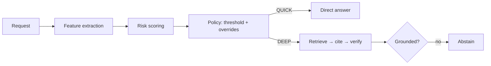

# Reliability Router

**Decides whether an LLM request can be answered fast, or needs the slow evidence-backed path — and says why.**

One decision, `QUICK` or `DEEP`, with a risk score, machine-readable reason codes, per-feature
contributions and a policy version attached to every call. It is a policy layer, not a correctness
oracle: it decides how carefully to answer, never whether an answer is true.

```bash
uv sync
uv run reliability-router route --query "What is the latest Bitcoin price today?"
```

```json
{
  "route": "DEEP",
  "risk_score": 0.4776,
  "risk_band": "MEDIUM",
  "threshold": 0.48,
  "reason_codes": ["FRESHNESS_REQUIRED", "TOOL_GAP", "EVIDENCE_GAP", "POLICY_OVERRIDE"],
  "forced": true,
  "policy_version": "1.0"
}
```

`forced: true` means a hard policy rule selected DEEP even though the score sat below the threshold.

## Where this component ends

The router decides *how much care a request needs*. It does not answer the request.

| the router owns | the surrounding system owns |
|---|---|
| the QUICK/DEEP decision and why | retrieval, tools, and the knowledge base |
| the risk features and policy version | the model that generates the answer |
| post-checks on a candidate answer | serving, auth, rate limits, logging |

The bundled retriever and answer provider are reference implementations. Swap in your own through
the constructor.

## How the decision is made



Twelve bounded features — ambiguity, high-stakes domain, freshness, citation need, multi-step
structure, and so on — are extracted in [features.py](src/reliability_router/features.py), weighted
in [scoring.py](src/reliability_router/scoring.py), and turned into a route by a versioned threshold
plus hard overrides in [policy.py](src/reliability_router/policy.py).

## Swappable intent parser

The QUICK/DEEP call is replaceable. Every family implements the same three-member protocol —
`name`, `version`, `parse(request) -> RoutingDecision` — and is chosen with `RR_INTENT_PARSER`:

| family | what it is | extra |
|---|---|---|
| `regex` | deterministic keyword and structure rules; the default | — |
| `tfidf` | character/word n-grams with a linear or boosted-tree head | `--extra tfidf` |
| `embedding` | frozen sentence embeddings with a classifier or k-NN head | `--extra embedding` |
| `bert` | a fine-tuned encoder classifier | `--extra bert` |
| `llm` | an LLM asked for the routing decision | — |

Artifact-backed families read their identity from the exported `manifest.json`, so a new variant
needs no code:

```bash
RR_INTENT_PARSER=tfidf RR_INTENT_PARSER_MODEL=models/intent_tfidf/exported/xgboost_v1 \
  uv run --extra tfidf reliability-router route --query "..."
```

## Results

1,000 held-out requests, each labelled QUICK or DEEP by two LLM judges with a third breaking ties,
at 91.6% inter-judge agreement.

| Parser | Version | Accuracy | DEEP F1 | p50 (ms) | p95 (ms) |
|---|---|---:|---:|---:|---:|
| distilbert | v1 | 86.9% | 87.9% | 41.3 | 46.4 |
| openai | gpt-5.6-sol-medium | 81.2% | 84.6% | 9,280.2 | 14,981.9 |
| tfidf_catboost | v1 | 80.9% | 81.8% | 8.2 | 9.3 |
| openai | gpt-5.6-luna-medium | 80.5% | 83.9% | 7,755.3 | 11,889.5 |
| tfidf_xgboost | v1 | 80.5% | 81.7% | 0.8 | 2.1 |
| tfidf_lightgbm | v1 | 79.9% | 81.3% | 1.2 | 2.3 |
| openai | gpt-5.6-terra-medium | 78.5% | 83.0% | 6,442.2 | 14,160.7 |
| anthropic | claude-sonnet-5-medium | 77.4% | 81.3% | 9,661.5 | 15,367.9 |
| tfidf_svm | v1 | 75.6% | 77.7% | 1.1 | 1.9 |
| tfidf_logreg | v1 | 75.3% | 76.9% | 0.6 | 1.4 |
| embedding_xgboost | v1 | 73.7% | 75.3% | 7.7 | 11.6 |
| embedding_catboost | v1 | 73.3% | 74.8% | 7.7 | 11.7 |
| embedding_cls | v1 | 73.2% | 75.0% | 9.3 | 15.3 |
| embedding_hgb | v1 | 73.2% | 74.6% | 16.5 | 21.1 |
| embedding_lightgbm | v1 | 72.9% | 74.7% | 7.7 | 11.6 |
| anthropic | claude-opus-5-medium | 72.0% | 79.7% | 9,811.1 | 14,276.8 |
| embedding_knn | v1 | 69.9% | 72.5% | 8.3 | 12.2 |
| regex | 1.0 | 53.0% | 35.1% | 0.1 | 0.5 |

```bash
uv run reliability-router evaluate     # scores a parser, appends one row
open artifacts/leaderboard.html        # sortable board, no server needed
```

The benchmark is a proportional sample of a 10,000-row set built from eleven public QA corpora plus
adversarial variants: prompt injection, planted contradictions, removed evidence, agreement
pressure, and rewritten-ambiguous questions. Models train on the other 9,000 rows.

## Serving

```bash
uv run reliability-router serve        # OpenAPI at http://localhost:8000/docs
docker compose up --build
```

`POST /v1/route` returns the decision, `POST /v1/answer` runs the chosen path, and
`POST /v1/route:batch` takes up to 100 requests. Every setting is an `RR_*` environment variable,
defined with its default in [config.py](src/reliability_router/config.py).

## Development

```bash
pytest && ruff check src tests
```

Tests run offline. The default path pulls in no ML dependency; a Streamlit dashboard
(`uv sync --extra dashboard && make dashboard`) reads the JSON eval report.

## Limitations

- Keyword and structure rules are not semantic understanding.
- Declared tools are not invoked here. `available_tools` informs risk estimation only.
- The bundled retriever ranks context the caller supplied. It is not a vector database.
- Evidence IDs prove linkage, not truth. A cited source can still be wrong.
- The benchmark is policy-defined and judge-labelled — an evaluation gate, not ground truth.
- Weights live in `config.py`. Production should load them from a signed, versioned artifact.

---

Copyright © 2026 Jerry Huang. All rights reserved.
